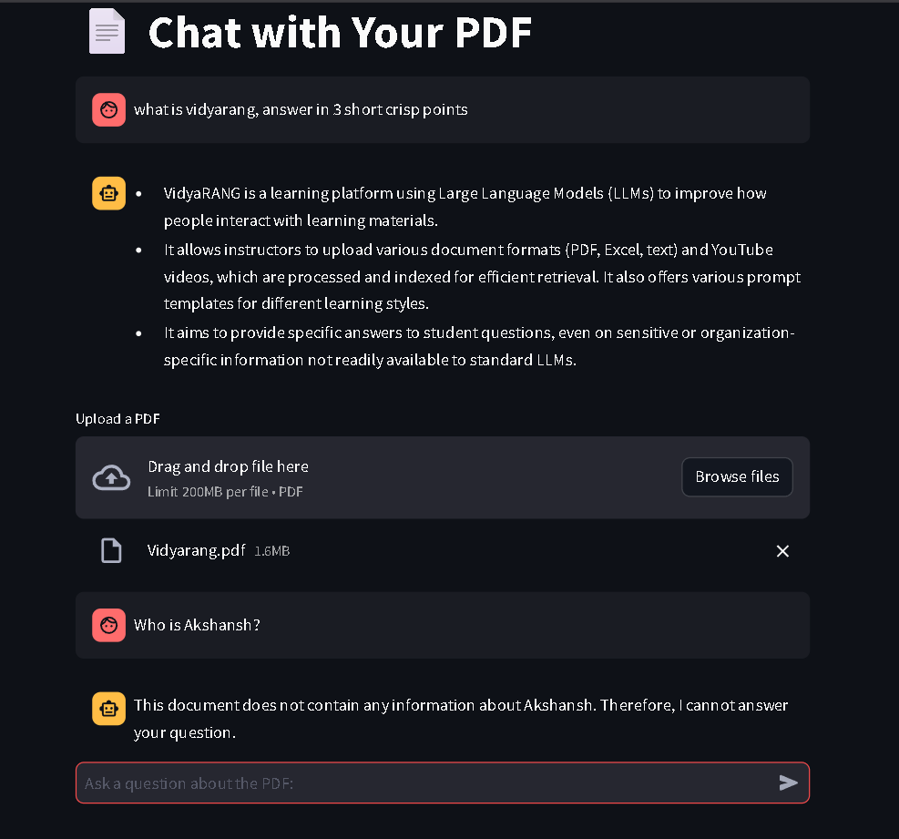

# 📄 Gemini + LlamaIndex PDF Chatbot

This project is an interactive PDF chatbot that lets you **chat with any PDF file** using **Google Gemini (via LlamaIndex)** and **BM25-based retrieval**. It uses a Streamlit interface for seamless interaction.



---

## 🚀 Features

- 💬 Chat interface for PDF documents
- 🤖 Uses Gemini 1.5 Pro via `llama-index` as the LLM
- 🔍 BM25 retrieval for keyword-based relevance without embedding
- 📚 Sentence-level chunking using LlamaIndex's `SentenceSplitter`
- 🧠 Session-based memory for per-PDF conversations

---

## 🛠️ Tech Stack

- [Streamlit](https://streamlit.io/)
- [LlamaIndex](https://github.com/jerryjliu/llama_index)
- [Google Gemini API](https://makersuite.google.com/app)
- [PyMuPDF (fitz)](https://pymupdf.readthedocs.io/)

---

## 🖥️ How to Run Locally

### 1. Clone the repository

```bash
git clone https://github.com/Akshansh0519/PdfBot.git
cd PdfBot
pip install -r requirements.txt
os.environ["GOOGLE_API_KEY"] = "your-gemini-api-key"
streamlit run app.py
